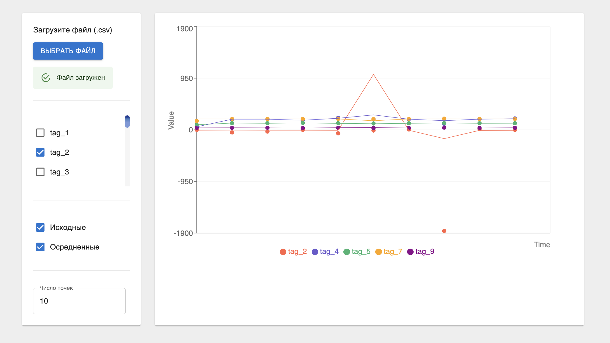

# Data Visualisation Dashboard

**Functionality:**
- CSV parsing
- Filters
- Charts

**Tech Stack:**
- React / TypeScript
- Redux Toolkit
- Material UI
- ReCharts
- Web Worker
- IndexedDB
- Feature Sliced Design Architecture

## To start the project

Install the dependencies:

### `npm i`

Start the dev server:

### `npm start`

Runs the app in the development mode.\
Open [http://localhost:3000](http://localhost:3000) to view it in the browser.

